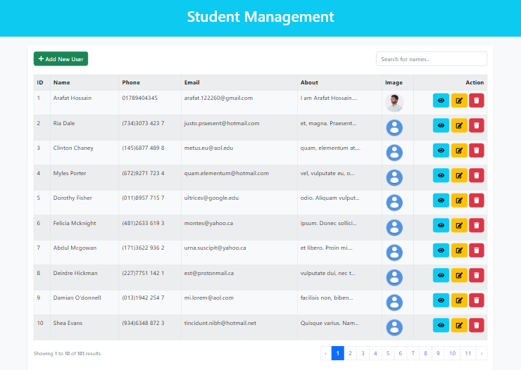
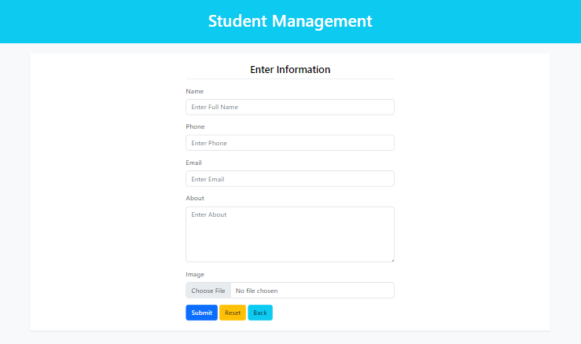
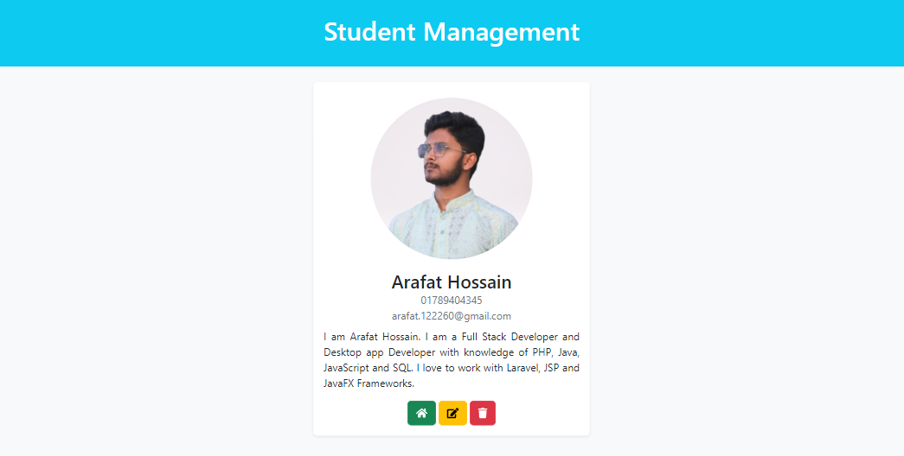
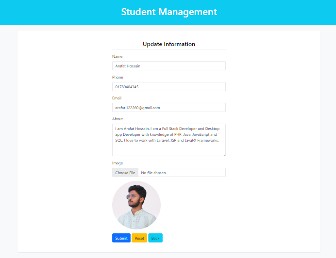

# CRUD using Laravel
 CRUD Operations using Laravel Framework

# Getting started

## Installation

Please check the official laravel installation guide for server requirements before you start. [Official Documentation](https://laravel.com/docs/9.x)

Clone the repository

    git clone https://github.com/arafat-web/CRUD-laravel.git

Switch to the repo folder

    cd CRUD-laravel

Install all the dependencies using composer

    composer install

Copy the example env file and make the required configuration changes in the .env file

    cp .env.example .env

Generate a new application key

    php artisan key:generate

Run the database migrations (**Set the database connection in .env before migrating**)

    php artisan migrate

***Bonus: You can import dumb data on your database from student.sql in public folder***

Start the local development server

    php artisan serve

You can now access the server at http://localhost:8000

***Note: Don't forget to add '/student' after the server link.***
# Screenshots

Home

 

Add

 

View

 
 
 Edit
 
 

 

 # Thanks
